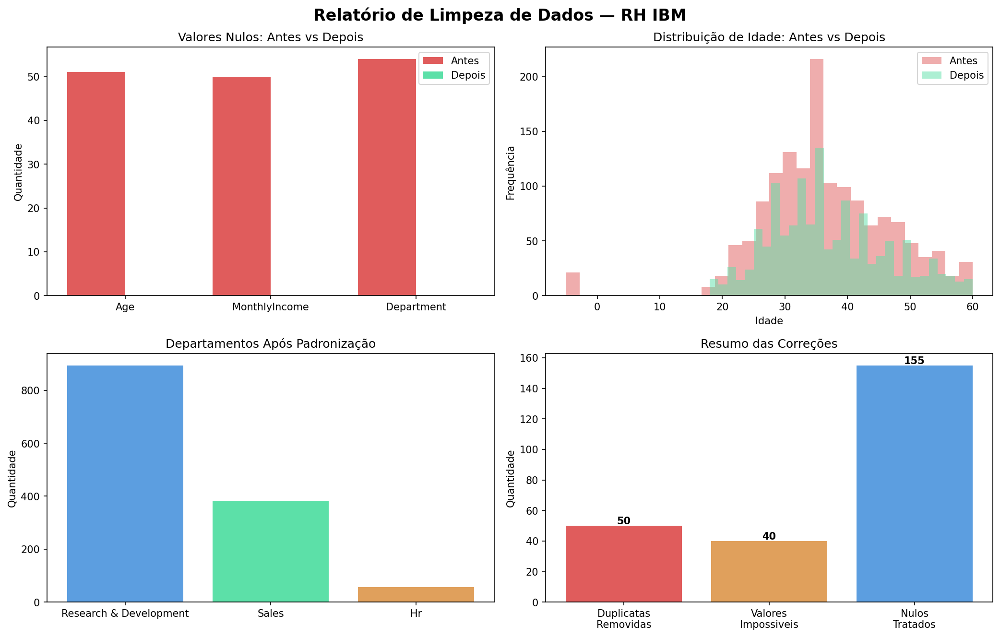

# 🧹 Limpeza de Dados — RH IBM

Projeto de tratamento de dados reais do dataset de RH da IBM, simulando um cenário comum no dia a dia de um analista de dados: receber uma base com problemas e entregar dados limpos e confiáveis.

## O problema

O dataset original da IBM foi corrompido com problemas reais encontrados em ambientes corporativos:

- **155 valores nulos** nas colunas Age, MonthlyIncome e Department
- **50 duplicatas** introduzidas na base
- **40 valores impossíveis** — idades e salários negativos
- **Inconsistências de texto** — departamentos com capitalização diferente (SALES, sales, Sales)

## O que foi feito

1. Identificação e remoção de duplicatas
2. Remoção de valores impossíveis (idades e salários negativos)
3. Preenchimento de nulos com mediana (numéricos) e moda (categóricos)
4. Padronização de texto com `.str.title()`
5. Exportação do dataset limpo em CSV

## Base de dados

Dataset real de RH da IBM disponibilizado publicamente para estudos de Data Science, com 1470 registros e 35 variáveis sobre funcionários.

| Coluna | Problema tratado |
|---|---|
| Age | Nulos e valores negativos |
| MonthlyIncome | Nulos e valores negativos |
| Department | Nulos e inconsistência de texto |

## Tecnologias

- Python 3
- pandas — manipulação e limpeza dos dados
- NumPy — geração dos problemas simulados
- matplotlib — visualização do antes e depois

## Resultado

